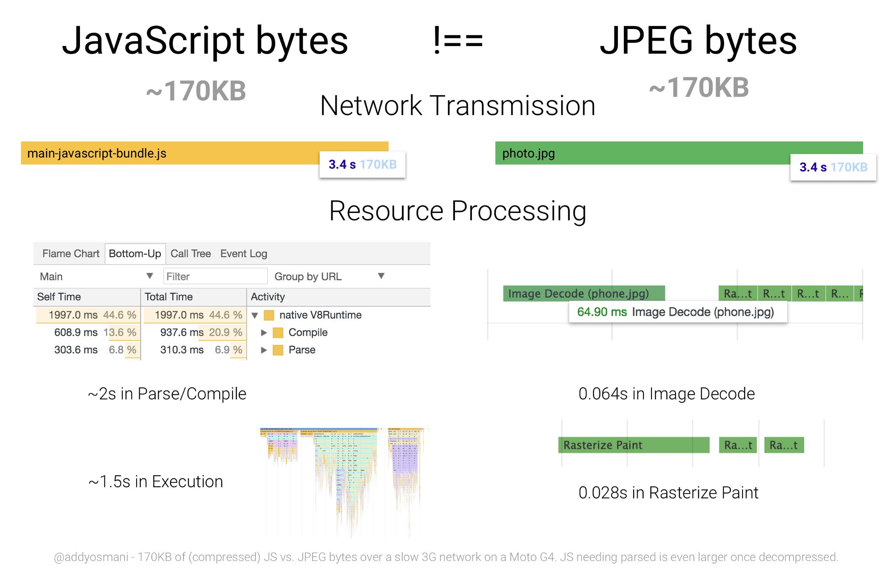

# 성능 최적화 \(Optimization\)

### 네트워크

기본적으로 UI 개발자는 **스크립트가 다운되고 실행되는 비용**을 우선적으로 생각하게 된다. 이는 분명 네트워크에 의존적이다. 3G, 4G, Wi-Fi 인지 등 네트워크의 상태에 따라 문제가 될 수 있다.

아래 방법을 통해 네트워크 비용을 낮출 수 있다.

* 사용자가 필요한 정보만 전송
  * [code-splitting](https://developers.google.com/web/updates/2017/06/supercharged-codesplit)을 통해 중요하거나 중요하지 않은 부분을 구분한다.
  * [webpack](https://webpack.js.org/)을 이용한다.
* 최소화
  * [UglifyJS](https://github.com/mishoo/UglifyJS) 를 사용해 [minifying](https://developers.google.com/web/fundamentals/performance/optimizing-content-efficiency/optimize-encoding-and-transfer#minification_preprocessing_context-specific_optimizations) ES5 코드로 최소화한다.
  * [babel-minify](https://github.com/babel/minify) 혹은 [uglify-es](https://www.npmjs.com/package/uglify-es) 를 사용한다.
* 압축
  * [gzip](https://developers.google.com/web/fundamentals/performance/optimizing-content-efficiency/optimize-encoding-and-transfer#text_compression_with_gzip)을 사용해 텍스트 기반의 리소스로 압축한다.
  * [Brotli](https://www.smashingmagazine.com/2016/10/next-generation-server-compression-with-brotli/) 사용
* 사용하지 않는 코드 삭제
  * [DevTools code coverage](https://developers.google.com/web/updates/2017/04/devtools-release-notes#coverage) 를 통해 코드 커버리지 확인 후 사용하지 않는 코드 삭제
  * [babel-preset-env ](https://github.com/babel/babel/tree/master/packages/babel-preset-env)를 통해 최신 브라우저에서 트랜스파일링을 피한다.
* 캐싱
  * [HTTP caching](https://developers.google.com/web/fundamentals/performance/optimizing-content-efficiency/http-caching)을 이용해 브라우저에서 효율적으로 캐싱하도록 한다.
  * 서비스워커를 사용할 수도 있다.

### 파싱 / 컴파일

크롬 개발자 도구를 이용해 퍼포먼스를 살펴본다. 가장 크게 드는 비용은 자바스크립트 엔진이 소스를 파싱하고 컴파일하는 과정이다. 

파싱, 컴파일되는 시간을 측정할 수 있다. 

단 자바스크립트와 이미지와 같은 리소스가 같은 크기라고 해서 동일한 성능을 내는 것은 결코 아니다. 이는 서로 다른 비용이다. 이미지는 로딩 과정에서 메인쓰레드나 이전 인터페이스를 막지 않는다. JS는 파싱과 컴파일 과정으로 인해 지체시키며, 실행 비용이 든다.

### 실행 시간

실행시간은 파싱과 컴파일되는 비용을 제외한 나머지 시간이다. 실행은 메인 쓰레드에서 일어난다. 

### 결론

전송 크기은 느린 네트워크에서 매우 중요한 요소이다.  파싱 시간도 CPU를 위해 낮게 유지할 필요가 있다.

만약 모바일 기기를 타겟으로 한다면, 퍼포먼스 비용을 더 고려할 필요가 있다.

{% embed data="{\"url\":\"https://developers.google.com/web/fundamentals/performance/optimizing-content-efficiency/javascript-startup-optimization/\",\"type\":\"link\",\"title\":\"JavaScript Start-up Optimization  \|  Web Fundamentals        \|  Google Developers\",\"description\":\"Keep your network transmission and parse/compile cost for JavaScript low to ensure pages get interactive quickly.\",\"icon\":{\"type\":\"icon\",\"url\":\"https://developers.google.com/\_static/7e3fe5b791/images/touch-icon.png\",\"aspectRatio\":0},\"thumbnail\":{\"type\":\"thumbnail\",\"url\":\"https://developers.google.com/web/images/social-webfu-16x9.png\",\"width\":1200,\"height\":675,\"aspectRatio\":0.5625}}" %}

